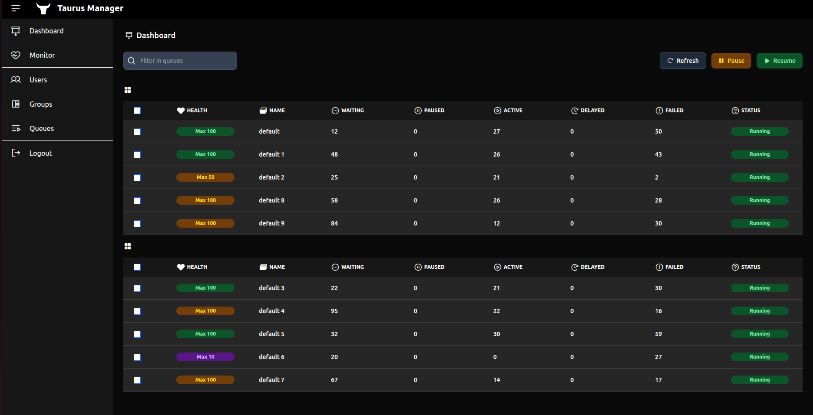
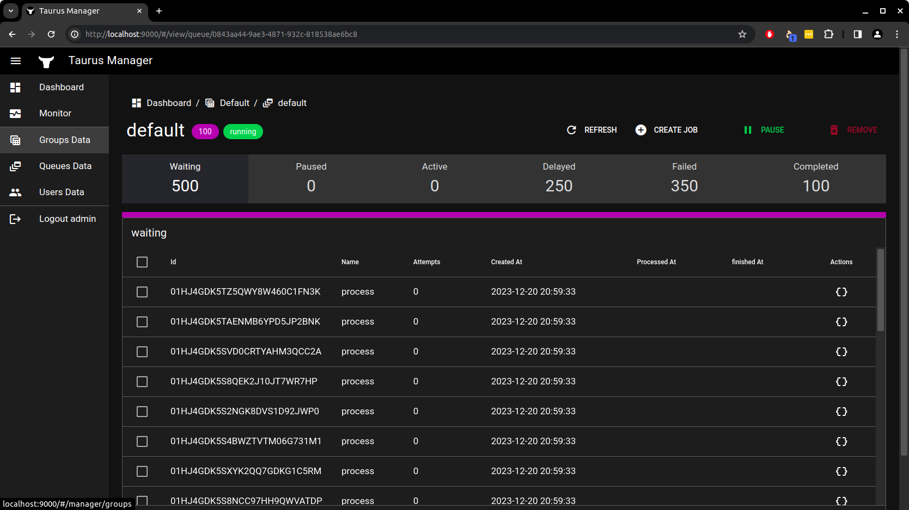
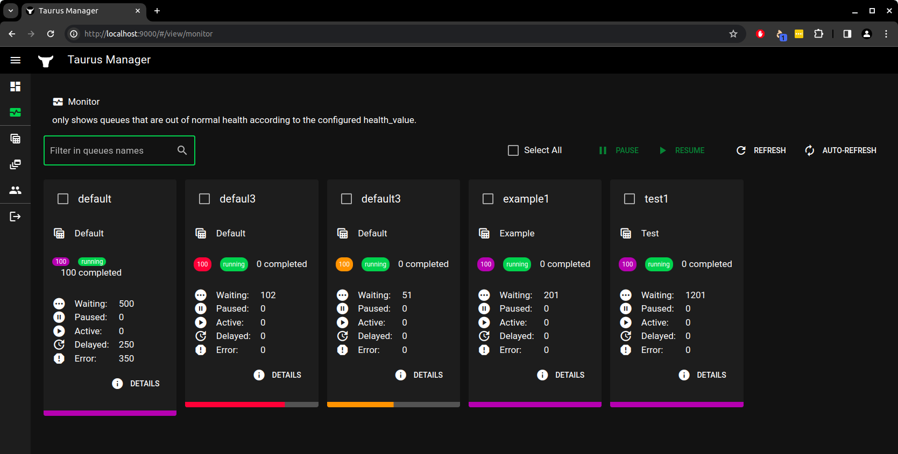

# Taurus Queue Manager

[](http://makeapullrequest.com)

## Overview

Taurus Queue offers a comprehensive queue ecosystem, simplifying the creation, execution, management, and monitoring of scalable and highly available queues. Leveraging the robust foundation of the [Bull Project](https://github.com/OptimalBits/bull), Taurus Queue eliminates the intricacies of queue coding, allowing you to concentrate solely on your specific actions and rules, thus optimizing your time. It features a dedicated interface for efficient queue management and monitoring.

Groups and queues list


Queue details


Monitor Screen (Monitoring only unhealth queues with auto-refresh)


## How the Queue Ecosystem Operates

### Setup and Job Publishing
1. Starting in [Taurus Queue](https://github.com/not-empty/taurus-queue-nodejs) for creating and running your first queue:
2. Publish jobs to your queues using our publishers, compatible with multiple programming languages:
   - [PHP Taurus Queue Publisher](https://github.com/not-empty/taurus-publisher-php-lib)
   - [Go Bull Publisher](https://github.com/not-empty/taurus-publisher-golang)
   - Node.js (native support with examples included in [Taurus Queue](https://github.com/not-empty/taurus-queue-nodejs) repository)
   - Use Taurus Manager interface to create new job to an existent queue
   - Python (Currently in development)

### Queue Management with Taurus Manager
3. Utilize this repository for managing your queues including:
   - Pausing/unpausing, adding/removing jobs.
   - Deleting, retrying, debuggin, viewing error logs and much more.
   - Managing user permissions.
   - Overseeing your queues.

### Real-Time Monitoring
4. Implement [Taurus Monitoring](https://github.com/not-empty/taurus-monitoring) for real-time graphical insights of your entire ecosystem, integrating with [Grafana](https://grafana.com) and [Prometheus](https://prometheus.io):
   - Queue Length
   - Job Duration
   - Queue States
   - Failures by Queue
   - Total Jobs Completed (All-Time/Periodic)
   - Sum of Completed Jobs (All-Time/Periodic)


### Installation

[Release 1.0.0](https://github.com/not-empty/taurus-queue-nodejs/releases/tag/1.0.0) Requires [NodeJs](https://nodejs.org) 20.x

First, you need to setup you `/etc/hosts`

For security measures, this project runs with CORs in strict mode, so to the backend and frontend can communicate correctly, they must both run on the same sub-domain

Configure your hosts file to redirect 127.0.0.1 to the frontend and backend domains adding this lines into your `/etc/hosts`:

Edit you hosts file with:
```sh
sudo vi /etc/hosts
```

Add this two lines
```
127.0.0.1 api.local.taurus.com
127.0.0.1 local.taurus.com
```

Save and exit

Now you can run Docker and all the ecosystem will automatically be running and you just need to scan your queues and use the manager.
:)

```sh
docker-compose up
```
### Scanning For Queues

Assuming you have a redis running Taurus Queues, you can use our `scanQueues.ts` located in `backend` folder, passing the host for the redis to scan and populate all your queues automaticly to the manager

```sh
docker exec -it taurus-manager-back bash
```

```sh
npm ts-node scanQueues.ts taurus-redis
```

### Login And Use

Now you can access your development environment `http://local.taurus.com:9000`, login using these credentials: username: `admin` password:`admin` and use the manager.

### Change Your Password

We know you know, but if you want to run in a production environment don't forget to change your password using the interface.

### Development

Want to contribute? Great!

The project using a simple code.
Make a change in your file and be careful with your updates!
**Any new code will only be accepted with all viladations.**

To ensure that the entire project is fine:

Run all validations

```sh
$ npm run check
```

**Not Empty Foundation - Free codes, full minds**
